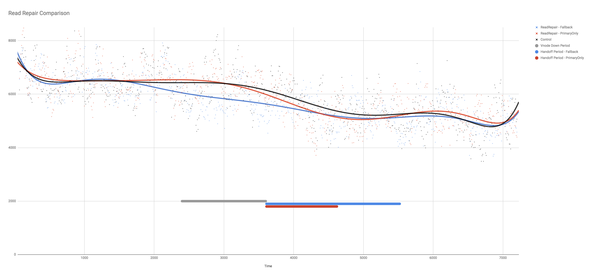

# Overview

Read repair is managed by the GET Finite State Machine.  Once the GET response has been returned to the riak_client, the FSM will wait for any late responses from vnodes (in state `waiting_read_repair`), and then once all responses have been received or the timeout has been reached - it is time to consider read repair within the `finalize` state.  Read repair will look at the vnodes which had a superceded version of the object (or returned a `not_found`), and prompt the more up to date object to be sent as an update to the vnode. 

The consideration here is about the selection of vnodes for read repair.  In Riak KV, read repair is done for all vnodes in the preflist (with an out of date object), both primary and fallback vnodes.  This is in contrast to active anti-entropy which only manages entropy between primary vnodes within any preflist - and doesn't try and resolve differences between primary vnodes and fallback vnodes.

In repairing fallback vnodes, the most up to date version of the object is further propogated, and it increases the proportion of the store for which the fallback vnode can provide an answer.  This may be of particular relevance in complex failure scenarios - with network partitions and multiple failures.

However, there are some negative consequences of updating fallback vnodes and not just primary vnodes during read repair:

- In read-heavy workloads additional write workloads are generated during failover.  For every preflist impacted by the node failure, every read now becomes a n=1 write.  This leads to the potential for a domino pressure scenario - whereby the capacity to handle work is reduced by failure, but the demand for capacity is increased by side effects of that failure.  
- On recovery of the primary vnodes, fallback vnodes will handoff all their data to the primary vnodes - this will include the PUTs from the applictaion received since the primary was unavailable, but also all the data received through read repair (the majority of which the primary may already have).  The unnecessary information being returned in handoffs increases the cost of the handoff (e.g. network bandwidth and disk I/O for the object fold), but more importantly causes the handoff to take longer - increasing the timegap when the returning primary vnode is inconsistent for coverage queries.

There are scenarios where read repair to fallbacks is helpful, especially when there is no active anti-entropy in place.  For example, if an object is PUT during the failure event and so is received by neither the primary or the fallback, but is fetched during the steady-state when the fallback vnode is in the preflist - then read repair will fill in the missing data in the fallback so that the fallback vnode can fill in the primary during handoff following recovery of the node.  Otherwise the primary vnode would not be aware of the missing change until the next object read (or AAE repair). 

Although it isn't necessarily true that running read-repair to fallback vnodes is incorrect or even unexpected behaviour, there is a potential that it may be sufficiently inefficient to justify making an option available to disable read repair to fallback vnodes, and instead read repair only primary vnodes.

# Testing the impact of read repair to fallbacks.

Testing of this was done with a baseline of Riak KV 2.2.3 release on a 5-node cluster.  The database was pre-populated with writes and then a 4 hour test was run with:

- 0 - 2400 seconds - test running as normal (80% reads 20% updates with about 30% of reads/updates for missing keys);
- 2400 - 3600 seconds - test running with node 4 stopped;
- 3600 - 7200 seconds - test running with node 4 restarted, with a period of handoff followed by a period of normal running.

There were three tests, with each test undergoing three runs with the average result taken to smooth out volatility associated with either leveldb backend performance or vagueries of cloud testing.  The three tests were:

- A control test when no failure occurrs (black trendline in chart);
- A test when the failure occurred on standard Riak KV 2.2.3 code (blue trendline in chart);
- A test when the failure occurred - but the code was [modified](https://github.com/martinsumner/riak_kv/blob/mas-2.1.7-readrepairprimary/src/riak_kv_get_fsm.erl#L509) so as to only update primaries (red trendline in chart).

It can be seen from the test results, that despite the failure of the node, the modified code supported throughput consistently within a reasonable margin of error of the control code.  However, with the failure on standard KV code there was a deficit on throughtput of between 7% and 10% on the control during the failure window, and a small 2% deficit on throughput whilst the handoffs were completed.

With the modified code, the handoff period was 47% shorter (17 minutes rather than 32 minutes).  During the handoff substantially less data was transferred (33GB and 2.2M objects with read repair to fallbacks, 11 GB and 750K objects with read repair to primary only).

# Conclusion

As expected the small change to read repair does have a positive impact on throughput during failover, and leads to reduced handoff time.  However the deficit on throughput during failover with read repair to fallbacks enabled is not catastrophic.  The new behaviour is better in this performance test, but the performance of the old behaviour isn't obviously intolerable.

Offering any configuration change is an increase in complexity to Riak.  It is unclear whether in this case the benefits of the change are sufficient to make a change to read repair worthy of further consideration. 