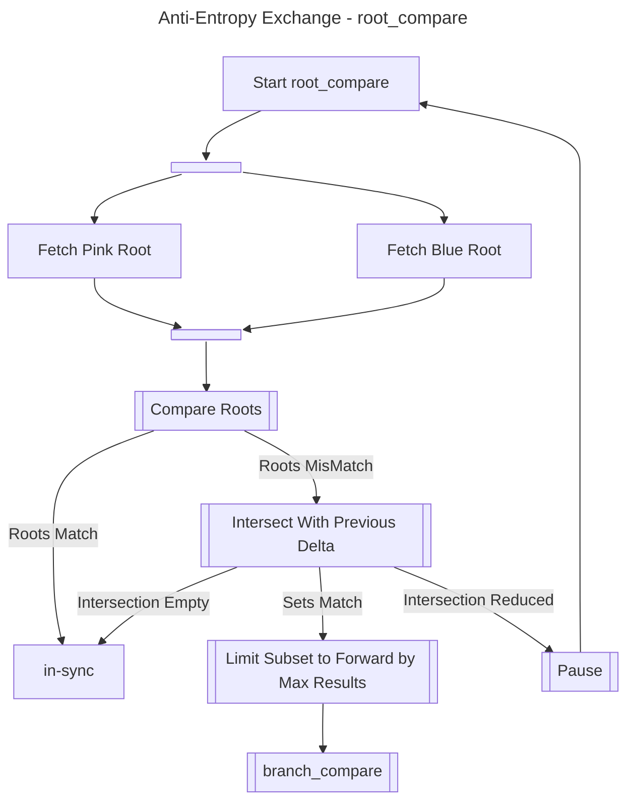
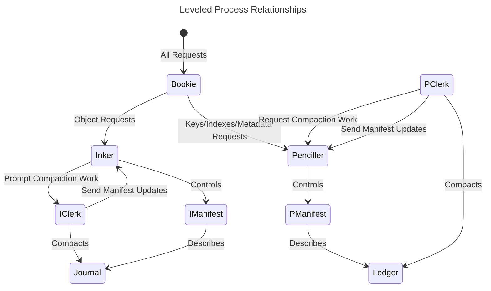

# Riak KV - Theory Guide

This guide is a work in progress, and provides insight into the underlying theories and processes which underpin the function of a Riak cluster.  Understanding this theory will be helpful to understand the design, setup and operation of a Riak cluster.

- [The ring and how data is distributed in Riak](#the-ring---the-distribution-of-vnodes)
- [Eventual consistency](#eventual-consistency)
- [Background processes](#background-processes)
- [Backend design](#backend-design)

## The Ring - The distribution of vnodes

Riak is a set of smaller databases which are distributed across physical nodes.  The smaller databases are termed vnodes, and the vnode is a set of functions that are controlling a database backend - where the backend (either leveled or bitcask) does the work to modify and fetch serialised data from disk.

The number of vnodes is the ring size, which must be a factor of 2.  It is desirable for the ring size to be much greater than the number of nodes (i.e. actual devices).  The ring size must be a factor of 2, because each key will be hashed to a given position in the ring, by taking a sha hash of the Bucket and Key, and using an equivalent function to: `Hash band (RingSize - 1)`.  This will give each key a position between `0` and `RingSize - 1`, i.e. zero-indexed position in the vnodes.

As the object should be stored in multiple places, normally 3 (which is the `n_val`).  An object is then mapped to the Position, and the `(Position + 1) mod RingSize` and `(Position + 2) mod RingSize`.  This position triple is called the preflist, or the set of primary vnodes for the key.

When a cluster is formed, a claim algorithm will distribute vnodes `0` to `RingSize - 1` around the physical nodes, so that all of these preflists fall onto 3 separate nodes, but also ensures that for every such position `(Position + 3) mod RingSize` is also on a diverse physical node to the preflist for that position.

To restore full data protection after failure, Riak must request the next node along in each preflist to start a fallback vnode.  For example, if a node holding vnode 10 fails, then this has an impact on the keys that have mapped to vnodes 8, 9 and 10 - they all now have a missing vnode.  three fallback vnodes will now be started:

- A key which hashes to vnode 8 will be stored in vnodes 8, 9 and a fallback for vnode 10 that has been started on the node which owns vnode 11.
- A key which hashes to vnode 9 will be stored in vnodes 9, 11, and a fallback for vnode 10 that has been started on the node which owns vnode 12.
- A key which hashes to vnode 10 will be stored in vnodes 11, 12 and a fallback for vnode 10 that has been started on the node which owns vnode 13.

If the distribution in claim is correct, the full divergence of `n_val` resilience is maintained even when a single node fails.  Having full resilience for greater numbers of failures is configurable (assuming there exists sufficient nodes).

Each primary vnode will store the data from three preflists, and only the data for those preflists - a vnode is never both primary and fallback.  The keys that map to itself (M), and the keys that map to `(M - 1) mod RingSize` and `(M - 2) mod RingSize` are those preflists.  Fallback vnodes will contain keys for just one preflist - so every primary failure requires the starting of three fallbacks.

In reality, the ring appears to be more confusing than it is, as it does not use simple integers `0`, `1`, `2`, `3` etc to represent the positions in the ring.  It actually uses the position from taking the hash bits from the high end of the hash not the low end i.e. for a ring size of 256 `Hash band (255 bsl 152)` is used rather than `Hash band 255`.  This causes all the vnodes to be instead named `0`, `1 bsl 152` (i.e. `5708990770823839524233143877797980545530986496`), `2 bsl 152` (i.e. `11417981541647679048466287755595961091061972992`)... etc, but the principle is still unchanged as if they were more simply `0`, `1`, `2`, `3` etc.

## Eventual Consistency

Riak is designed to be eventually consistent, in that it is:

- Permissive about accepting updates, ensuring data is stored securely on behalf of the application, even when the current state of the data relative to the update cannot be guaranteed;
  - either because some state may be in geographically diverse location, and waiting for verification of the present state would cause an unacceptable increase in response time,
  - or because failure of individual components has limited the visibility of the current state.
- Definitive that all changes will eventually be visible;
  - not just because data is replicated between nodes and between clusters,
  - but also because it is continuously reconciled, with background process that efficiently analyse the overall system for discrepancies and proactively heal those deltas without operator intervention,
  - where that continuous reconciliation occurs both within and between clusters.

It should be noted that Riak offers the same guarantees of zero-intervention eventual-consistency for both multi-cluster environments as well as single cluster environments.  However, within a cluster it is possible to enforce conditions on writes to make Riak less permissive, but less likely to result in conflict e.g. through the use of [conditional PUTs with token-based consensus](./ObjectAPI.md#conditional-requests).

Care may be taken by the Riak user to avoid conflict; but inevitably there will be some object values that eventually end-up in conflict.  When in a conflicted state, an object may have two values where the database cannot determine which is the most current, often as updates were made concurrently by two different application instances.

Not being eventually consistent in a database, is likely to increase the operational processes required during failure scenarios: e.g. static failovers between primary and standby clusters, intervention to recover from replication failures between regions.  With eventual consistency: the gain in operational simplicity and reduced operational intervention, is a trade-off against the developer overhead of considering conflict.

{: .note }
> Handling an object where the value is in doubt, adds cognitive load to the application developer - it is the key trade-off between the operator and the developer to accept when adopting Riak.  At small-scale, and when downtime is acceptable; it is almost always preferable to favour the application developer in the trade-off.  Riak is an answer to exceptional use cases with demanding non-functional requirements, not a general purpose data-storage solution.

It is possible to craft objects whereby the situation can always be resolved, known as conflict-free replicated data-types.  However, designing a system based only on those data types is another type of cognitive load for the application developer.

In general, most applications that depend on Riak evolve strategies to restrict and manage conflict scenarios:

- Separating immutable and mutable data into different objects.
- Using application conditions to direct updates to clusters to avoid conflicting cross-cluster updates on the same object.
- Use sharding within the application or Riak's conditional PUT controls to avoid intra-cluster conflicts.
  - Potentially adopt an event sourcing CQRS-type pattern, to first secure capture of the data and then retry updates to queryable stores, so that refusing a write downstream will not lead to a risk of data-loss.
- Adding metadata to objects to allow deterministic resolution in either all cases, or just common cases.

### Quorum on Read, Write and Query

The default GET and PUT options are based on validating quorum within the cluster before returning a response to the client.  Quorum meaning that a majority of vnodes within a preflist must have provided acknowledged input to the transaction.  So although Riak offers a guarantee that data will be eventually consistent; within a single, stable cluster an application will still [read its own writes](https://jepsen.io/consistency/models/read-your-writes).  There are tunable consistency [properties in Riak](./InstallAndStartGuide.md#configuration-of-riak---bucket-properties), that can be used to extend this guarantee to clusters during individual node failures.

{: .note }
> Quorum is the default for [the Object API](./ObjectAPI.md), but not the default for [the Query API](./QueryAPI.md).

All index updates within a vnode are transactional to the object change; so that in a single, stable cluster, queries will immediately reflect the latest update.  There is no post-update delay for indices to be updated. However queries have to be distributed across a covering set of primary vnodes, and this covering set will include a single replica of each object.  If a primary vnode is active but not up-to-date (i.e. due to a recent recovery from failure or corruption), query results are not validated by checking results between replicas.

The issue of missing data in coverage queries during the recovery process, can be mitigated by relying on operator intervention, using the `participate_in_coverage` setting to block a recovering node from participating in queries.

It is possible to use inverted indexes for queries within Riak, so that queries can also use quorum reads.  However, using inverted indexes in Riak 3.4 requires management from within the application, not the database.

### Version vectors

The default mechanism for tracking causal consistency on Riak objects is Dotted Version Vectors.

{: .note }
> Within Riak documentation and within the APIs, the name vector clock is used to refer to both the current recommended approach (dotted version vectors), and the previous legacy approach (loosely based on logical clocks).

A dotted version vector has two parts:

- A list of actors, and count of changes which have been coordinated by that actor (a per-actor sequence number);
- A dot attached to each content value, where the dot is the actor and actor-specific sequence number with which that change was introduced.

If there are two objects, one can be considered to be dominant (or more advanced) if within the version vector all the sequence numbers on all the actors are either equal to, or greater than, those on the other object (and at least one is greater than).  An update being dominant within the version vectors allows it to be updated in the backend without the need for a comparison and merge between the objects.

If there are two versions of an object, and neither version vector is dominant, then their contents are potentially siblings: the causal consistency cannot determine which is the more advanced value.  However, it may be possible to determine from the "dot" on a given value that the conflict is unrelated to that particular value, because either:

- Both changes see this as a replaced content value, or;
- The content value has the same dot, and so can be assumed to be the same value (a value cannot be a sibling of itself).

These two characteristics are important to avoid sibling explosion, which might otherwise result when multiple application processes are concurrently trying to update the same object (and correct the sibling state).  It is also important to the pruning of version vectors.

{: .note }
> The actors within the version vectors are the unique vnode IDs that have coordinated change on an object.  The number of actors will grow over time as as an object is updated by different vnodes in a preflist, via different cluster preflists and as the membership of a preflist is changed by the promotion of fallbacks during failure or the reshuffling of vnodes on cluster change.

As the list of actors in the version vector will grow over time, the version vector needs to support pruning.  Pruning is not coordinated, and happens independently on each vnode (and on each cluster) for that object key, when the vector exceeds a configured size limit.  Pruning of old information from version vectors will lead to false conflicts between version vectors: but this is highly unlikely to cause siblings, as the "dot" of the content can be used to confirm that the current object was not related to the portion of the version vector in conflict (i.e. it was not coordinated by a pruned actor).

Detailed information on the implementation of dotted version vectors in Riak can be found in the [original evaluation](https://asc.di.fct.unl.pt/~nmp/pubs/inforum-2011-2.pdf).

## Background processes

Riak has a number of background processes:

- The primary background process in Riak, when configured, is [Tictacaae active anti-entropy](#anti-entropy), the continuous reconciliation process used to ensure all vnodes are eventually consistent.
- There are a [number of queue based](#disk-backed-queues) background processes, through which non-urgent activity can be deferred, to manage the impact of this activity on the performance of externally prompted requests.
- Maintenance of the distributed knowledge of the cluster state is managed by [background processes within the riak_core application](#riak-core-cluster-management).

### Anti-Entropy

Riak tracks the current state of the Version Vectors across the whole key-space to perform anti-entropy, to recover an object to its most up-to-date value if a vnode has a stale or missing entry.  Anti-entropy can be used both within and between clusters, using special cached and mergeable merkle trees; these trees allow entropy to be tracked across large key-spaces highly efficiently.

Anti-entropy is in addition to other mechanisms that repair in reaction to the detection of failure (read repair), or in update vnodes following cluster changes (handoff for both repair, cluster change and recovery of fallbacks).

{: .highlight }
> The active anti-entropy process is designed to be highly efficient, and very quick, when confirming no deltas exist; o(10s) to confirm alignment between o(10bn) objects.

The work to compare between stores has a low resource cost.  The work to discover and repair deltas is relatively expensive, but is throttled in default configuration to avoid overloading the database.  As there are other anti-entropy mechanisms (e.g. quorum reads with read repair); slow repair is preferred to high repair-related resource utilisation.

The anti-entropy trees have 1,024 branches, and each branch has 1,024 leaves.  Each key in the store is mapped by a hash algorithm into a given leaf.  The hash value of that leaf is calculated by taking a hash of the Key and version vector combined, and then performing an `xor` operation on all the hashes within that leaf.  The hash value for each branch is the hash of each leaf in the branch combined using `xor`.

Each vnode has a cached tree for each preflist the vnode supports (with a single `n_val` in the cluster there will be `n_val` preflists in each vnode, and hence `n_val` cached trees per vnode). The cached tree represents the state for the whole preflist on the vnode.  When an object is modified, then the object key and the both the previous and current version vector is sent to the `aae_controller` for the vnode; which will update the correct preflist's tree cache, using a double xor operation.  In effect one xor to remove the previous hash, and one xor to add the new hash.

The intra-cluster anti-entropy can then compare the preflist tree for one vnode, with the preflist tree of another vnode within the same preflist, to confirm if the vnode's are in-sync for that preflist.  To make that comparison, only the 1,024 hashes (4KB) of the branches are compared, this is known as the root of the tree.  If there is a delta, then the same comparison will be run in a slow loop - checking for deltas which are constant across the loops.

If the `root compare` loop stabilises on a non-zero number of deltas, then the 1,024 leaves in those branches are compared in a loop to find a constant delta - this is then the `branch_compare` loop.  If there is no constant delta, the trees are considered in sync (i.e. any discovered delta was a matter of timing).

The `branch_compare` loop is an identical process to the `root_compare` loop, and if that confirms a consistent delta the `clock_compare` process is triggered.

If a set of leaves is discovered to be out-of-sync following `branch_compare`, the `clock_compare` process is initiated.  A `clock_compare` is a comparison between the objects in a subset of leaves to discover which objects need repair.  To compare the objects between vnodes, only the Version Vectors need to be compared.  To find the Keys and Version Vectors for a set of leaves, a fold over the whole keystore (either native or parallel) is required - however that fold is passed the segment IDs (an integer identifier for the leaves), and the store has in-built hints to filter out blocks of keys that do not contain segment IDs of interest.  This means the cost of finding Keys and Version Vectors is significant, but mitigated by the segment ID acceleration.

To limit the volume of data to be compared, and improve the performance of searches for Keys and Version Vectors, the number of segment results to be compared as a result of any exchange is limited.  All anti-entropy processes will also try and gather information from previous delta discoveries to intelligently reduce the scope of future discoveries.  For example, by looking at the modified date range in which differences fall, or if they are limited to specific buckets.  With information from previous deltas, the cost of finding more deltas can be reduced.

There exists the possibility that some event might cause the tree cache to become out of sync with the vnode backend store.  There are two processes to control this should it occur:

- when requested to find all Keys and Version Vectors for a set of segment IDs, the tree cache is also rebuilt for those leaves as part of the query.
- periodically there will be a cache rebuild event, where there will be a fold over the keystore, and a full rebuild of the tree cache.

When running Anti-entropy in parallel mode, there is also a need for periodic rebuilds of the keystore.  These may be expensive events, depending on the size and type of the store.  The rebuild jobs use random factors to try and prevent coordination of rebuilds between stores, and rebuilds are also queued using the node worker pool to prevent excessive concurrency of rebuilds.

Inter-cluster reconciliation uses the same principles as intra-cluster reconciliation.  For inter-cluster reconciliation the state of the clusters must be compared, not the state of the vnodes - two clusters may have different ring sizes, so a vnode-to-vnode reconciliation would not necessarily work.  To find the state of the cluster, the trees for all preflists can be merged into one tree using the `xor` operation.  Special coverage queries known as AAE folds, are used to either merge tree components, or to find Keys and Version Vectors across the cluster.

The cost of resolving entropy inter-cluster is higher than with intra-cluster entropy - and so the throttling of that resolution is generally stricter.

### Disk-backed Queues

There are a number of internal Riak services that are built on a common queue behaviour: real-time replication, the reaper, the eraser and the reader.

These queues have a small in-memory portion, but once the queues grow beyond that minimal size they are written to disk using the internal Erlang `disk_log` facility.  The use of disk for the queue is solely to control the amount of memory consumed by the queue, as Riak has no protection against the overuse of memory within a node.  When a node is restarted, the disk-based queues will be erased.  This prevents a situation where a restart due to corruption of a queue, leads to a continuous cycle of reboots as the same corruption is reprocessed.

Each queue has multiple priorities, and an item added to the queue is assigned a priority.  Higher priority items are always consumed before lower priority items.

### Riak Core cluster management

The Riak KV store is built on top of a generic platform for building distributed systems called `riak_core`.  The `riak_core` system, provides a number of underlying components with which Riak is rebuilt:

- `riak_core_ring`
  - An implementation of [the ring](#the-ring---the-distribution-of-vnodes), the distribution function in Riak.
- `riak_core_ring_manager`
  - A process that marshals updates to the ring, and ensures that stable versions of the ring are available to database processes via a low latency cache.
- `riak_core_vnode`
  - The behaviour which the `riak_kv_vnode` implements, defining the callback functions necessary for the vnode to handle requests and also changes to the ring (e.g. handoffs).
- `riak_core_vnode_proxy`
  - Every vnode has a proxy that forwards requests to the vnode, whilst tracking the size of the message queue on the vnode.
  - The proxy is responsible for blocking access to the vnode when the message queue (also known as the mailbox) is overloaded.
  - All vnode requests are forwarded through the proxy, but responses bypass the proxy and are sent directly back to the requesting process.
- `riak_core_vnode_manager`
  - Responsible for starting local vnodes when required by the ring, and stopping those vnodes no longer required.
    - The receipt of a request for a vnode that is not started locally, will also prompt the starting of a vnode - there is no wait for periodic ring checks to detect the change of topology.
  - Also triggers handoffs for vnodes in response to cluster changes, through the `riak_core_handoff_manager`.
  - The initial trigger for a handoff is a vnode timeout, when a vnode sees a period of inactivity beyond the timeout, it will contact the `riak_core_vnode_manager` to see if a handoff is required.
- `riak_core_handoff_manager`
  - Manages handoffs required for cluster topology changes or vnode repairs.
  - Applies concurrency controls, tracking progress and the success or failure of transfers
- `riak_core_capability`
  - A mechanism for registering the capability of a node, and then discovering the "lowest capability" for a given feature supported by all nodes in the cluster.
  - Required to manage functional changes dependent on the availability of updated features, in the presence of rolling upgrades.
- `riak_core_metadata_manager`
  - Stores a node-specific copy of cluster-wide metadata, detecting and resolving differences in metadata between nodes in the cluster.
  - The cluster metadata is used for information about bucket types, and security controls.
- `riak_core_claimant`
  - A cluster node through which cluster administration changes are prompted.

For further information on `riak_core`, there is a lightweight version of `riak_core` called `riak_core-lite` [for which there are helpful tutorials](https://riak-core-lite.github.io/).

## Backend Design

For Riak 3.4, there are two backends recommended for use in production systems:

- the bitcask backend;
- the leveled backend.

### The bitcask backend

The bitcask backend within Riak 3.4 is unchanged from its original design.  Refer to the [explanation of the bitcask design which accompanied the original release of bitcask](https://github.com/basho/bitcask/blob/develop-3.0/doc/bitcask-intro.pdf) for further information.

In Riak 3.4, the bitcask backend does not support three important operations:

- An efficient response to a HEAD request, which impacts the stability of response times under high-stress conditions.
  - Adding support for HEAD requests is considered a high priority for future Riak releases.
- Ordering of keys, and so indexes and the Riak Query API are not supported.
  - There are no plans to amend this limitation in the future, except possibly through the potential to support an inbuilt inverted index functionality.
- Native support for anti-entropy, and AAE folds.
  - Parallel-mode (non-native) AAE is required to support AAE folds and all related functionality (e.g. inter-cluster reconciliation via AAE).

### The leveled backend

The leveled store is written in Erlang, where each entity (e.g. file or manifest) in the datastore has a dedicated owning process; and a consistent view is maintained through that ownership model rather than by the management of locks to marshall access to resources between processes.  It is designed to be scaled out by running many stores, not by parallelism within the store itself.

{: .highlight }
> The design of leveled is based on the log-structure merge-tree (LSM) data structure, but unlike most other implementations of LSM trees the values are set-aside on receipt, and only keys and metadata are kept within the LSM tree.

The setting-aside of values reduces the write amplification associated with the compaction of the LSM tree, especially when the object metadata is much smaller in bytes than the object value.  It also provides a differential cost of read; whereby a HEAD request (to return metadata) is much lower cost than a GET request (return the whole object).  This differential cost makes the store suited to environments where HEAD requests are more common than GETs; which is the case within Riak as each cluster GET is formed normally from the result of 3 backend HEAD requests and just a single backend GET.

The leveled datastore is designed using an actor model, the primary actors being:

- A Bookie;
  - The single external-facing actor that handles the inbound queue of requests.
- An Inker;
  - An actor that supports a journal of values, that acts as an append-only log of objects received,
    - The journal being a collection of sequence-ordered files described in a manifest.
    - The journal being the primary source of truth in the store.
- A Penciller;
  - An actor that controls a sorted ledger of keys (both object and index) and metadata,
    - The ledger being a collection of files described in a manifest, sorted by key at each level.
  - The ledger is not required to be reliable, in that the ledger can always be reconstructed from the journal.  
- Worker Clerks;
  - Both the Penciller and Inker each have a dedicated clerk that is responsible for compaction; asynchronous changes to the organisation of the files which make up the system.
  - The clerks create the additional files required by the compacted system, and then inform the responsible actor (Inker or Penciller) of the required manifest changes to introduce those files.
- Files
  - Every file in leveled is an individual process, a state machine which owns a single file handle.
  - A file will first exist in a `write` mode, but once written will be switched to an immutable `read`-only mode.
    - The overall store is built on immutable files, compaction relies on the replacement of files, not the mutation of files.
  - Once a file is replaced in the manifest it will enter a `delete_pending` state, in which it will poll the controlling process (Inker or Penciller), to await confirmation that it may self-destruct (when no active manifest depends on it i.e. all relevant snapshots have closed).
- Snapshot Inker/Penciller
  - Both the Inker and Penciller can spawn clones, new processes with a replica of the manifest, registering the existence of those clones (or snapshots) in the primary Inker or Penciller.
- Monitor;
  - A central process for receiving stats from the other processes and reporting via scheduled logs the latest statistics for the store.

#### Caching and Acceleration

Each process within Leveled has an in-memory state, that contains:

- Information on the structure of the data kept by that process (e.g. a map of key ranges to on-disk data);
- A small cache of high priority information (e.g. an in-memory view of recent updates, or recent reads).

These caches are designed to ensure that every CRUD request can be fulfilled on average by 1 disk action or fewer.  All compaction activity is based on bulk writes of fresh files, not on mutation of existing files.  The leveled store, when compared to alternatives, requires a relatively low volume of internal I/O actions per external request.

{: .note }
> The leveled backend is focused on supporting characteristics that enable the file system page cache to be more effective, rather than managing its own caches to optimise performance.

Acceleration in leveled is provided through the use of hashes of keys, and the support throughout the system of hash-based lookups and lookup avoidance via bloom filters.  There is alignment between the hashes used by the ledger's filters for lookup avoidance and the hashes used in the anti-entropy merkle trees.  This alignment accelerates queries over key ranges when the results need to be filtered on leaves of the anti-entropy tree.

#### File Formats

The files within the Journal are ["Constant Database" files](https://en.wikipedia.org/wiki/Cdb_(software)), once they are moved into a `read` state.  There is one, and only one, active Journal file in a leveled store - and this is an append-only file that uses an in-memory table to map keys to file positions.  Upon migration to the `read` state a CDB hash table is appended to the end of the file.

The files within the Ledger are loosely based on the same concept as [block-based Static Sorted Tables SST (SSTs)](https://github.com/facebook/rocksdb/wiki/A-Tutorial-of-RocksDB-SST-formats).  Blocks are not governed by size (in bytes), but by number of keys which they contain (between 20 and 60 depending on the type of key); there is no alignment between blocks in the leveled SST files and blocks in the file system.  The table is divided into slots, where a slot is a group of five contiguous blocks (with between 128 and 256 keys per slot).

Data is serialised for persistence in Journal or Ledger files using a combination of the `zstd` compression algorithm and the Erlang standard `term_to_binary/1` function.  Other compression algorithms are supported - `none`, `native` (zlib) and `lz4`. In general, only `zstd` should be used, but in some specific scenarios `none` may be valid configuration for the Journal.  Grouping for serialisation is at an individual object level in the Journal, and by block in the Ledger - accessing an individual key in the ledger requires a whole block to be deserialised.

#### Data safety and security

The security of data within Leveled is provided by a combination of:

- Use of append-only writing of data to files, no internal manipulation of the file structure to manage mutation;
- Use of CRC checks on all serialised objects in both the Journal and the Ledger;
- The concurrency controls inherent in the model with the well defined process-scope for updating files and manifests;
- The ability to rebuild the Ledger from the Journal.

More detailed information on safety and security features [may be found in the leveled repository](https://github.com/martinsumner/leveled/issues/432).

#### Compaction

Compaction is managed in the ledger by the penciller's clerk (the `leveled_pclerk`), and in the Journal by the inker's clerk (the `leveled_iclerk`).

Compaction of the ledger is enforced by fresh write activity.  New writes to the store are appended to the active Journal file and then the related key and metadata changes added to an in-memory cache of recent ledger updates within the Bookie.  When the in-memory cache reaches an approximate threshold then the cache will be flushed to the in-memory cache of the Penciller.  When the number of the Penciller's in-memory cache lines reach an approximate threshold, it must write a new "level-zero" file to disk.

{: .note }
> All thresholds and timeouts in leveled are approximate, as any configured values must be jittered to avoid accidental coordination of activity between vnodes, either within a node or within a preflist.

The writing of a level zero file triggers a cascading process managed by the Penciller's Clerk.  When the clerk is next available it must merge that file from Level 0 into Level 1.  It then must look at the count of files at each level, and determine if any level is bigger than the fixed size for that level; and if it is, merge a file down to the lower level.  The maximum size of each level is based on file count alone.

When there are multiple outstanding lower level files to be merged, then the Penciller is in a backlog state.  In that backlog state the Penciller's Clerk will continue to prioritise freeing space in Level 0, but the Penciller will refuse to accept new cache lines from the in-memory cache of the Bookie.  The Bookie in turn should enter `slow-offer` mode, where it requests a pause from the vnode following a successful PUT to temporarily block more activity - this is logged and configured as a `backend_pause`.

{: .highlight }
> The pace of writes to a vnode cannot outrun the workload of the Penciller's Clerk, and the aim is to handle a backlog by gradually degrading responses in the system rather than suddenly stalling activity.  

For individual leveled stores the Penciller's Clerk may be a bottleneck.  The clerk is single-threaded, as parallelism exists across the node by running multiple vnodes - there should normally be multiple vnodes (and hence clerks) per CPU core on each server.

Whereas ledger compaction is reactive to fresh write activity; the journal compaction is periodic, prompted by a jittered schedule of timeouts.  The journal compaction process is not blocking, in that it will __not__ prompt the `slow-offer` state if there is a backlog; a backlog of Journal compaction will result in an increasing overhead on disk space utilisation, not a slowdown in the store.

Journal compaction requires each file to be scored, the score being an assessment of the proportion of the file's space that would be freed by compacting the file.  Files are always compacted in contiguous groups to control the level of fragmentation in the Journal.  Scoring is done by reading a random set of keys and their value sizes, and checking against the ledger if the value in this Journal for each key is the active value in the Journal; and comparing the reclaimable space against the space required to be retained.

Once scoring is complete in a compaction run, any runs of files that exceed the configured compaction threshold are considered to be candidates for compaction, and the candidate run with the best score (the largest estimated volume of space to be freed) is chosen.  For that compaction run all keys are read in SQN order across the candidate files, checking in the ledger the current SQN of each Key and then either writing or discarding the object as appropriate.  Once a new set of files has been written and made read-only, the Inker's clerk will send the proposed change to the Inker to prompt a manifest update.

{: .note }
> Any crashes during compaction will lead to uncleared garbage rather than corruption; as the manifest change is made at the end, the store will always be restarted from the state at the commencement of the compaction job unless a compaction job is fully completed.

#### Head-only Mode

Leveled is used as the parallel-mode store for Tictac AAE, as well as an optional vnode storage backend.  When leveled is used in parallel mode AAE it is started in an alternative mode - `head-only` leveled.

When running in `head-only` mode, leveled is a metadata-only store: the ledger is now the source of truth, and the Journal is used only to persist batches of key/metadata changes that have not yet progressed from the in-memory ledger cache to the persisted files.  On startup, the ledger is started and the Journal is used to re-apply changes to the ledger from the sequence number of the last persisted change.

Should the Ledger be corrupted or lost in `head-only` mode, then it must be recovered from another source. In the case of leveled as a parallel-mode keystore for anti-entropy; it can be recovered by rebuilding from the vnode object store.
